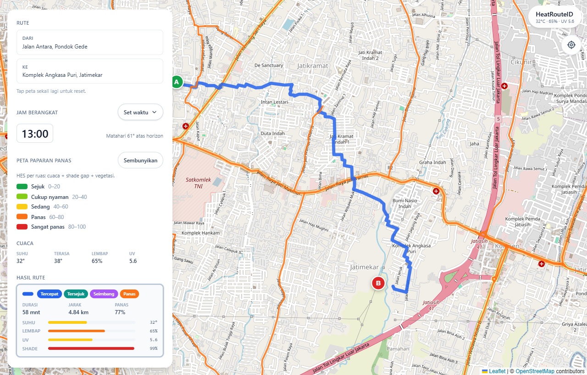

# HeatRouteID

Heat-aware pedestrian navigation untuk kota tropis Indonesia.

> Repository ini adalah submission untuk **[IYREF 2026 Hackathon](https://www.sreitb.com/iyref/hackathon)** (Indonesia Youth Renewable Energy Forum, SRE ITB) — sub-tema **Climate Resilience & Local Wisdom**, oleh tim **Lontong Sayur** (Universitas Indonesia).

---

## Status

🚧 Stage 2 (Pre-Eliminary) — submit deadline **Kamis, 7 Mei 2026** (extended dari 6 Mei per Announcement Pre-eliminary). Repo dalam pengembangan aktif.



## Konsep

Navigasi pejalan kaki yang membandingkan tiga pilihan rute berdasarkan **Heat Exposure Score (HES)**:

- 🏃 **Fastest Route** — rute tercepat klasik (ETA-optimized)
- 🌳 **Coolest Route** — rute paling teduh (HES-optimized)
- ⚖️ **Balanced Route** — kompromi waktu × paparan panas

Secondary output: **Shade Gap Map** yang menandai ruas jalan dengan defisit teduh — input awal untuk perencanaan penghijauan kota oleh pemda.

## Fitur MVP

| Fitur | Deskripsi |
|---|---|
| **Input titik awal & tujuan** | Tap di peta atau ketik alamat. Pin A (start) dan B (end) dengan label nama tempat dari reverse-geocoding OSM. |
| **3 mode rute** | Tercepat (ETA), Tersejuk (HES-min), Seimbang (waktu × HES). Di-render bareng di peta dengan warna berbeda + per-route breakdown. |
| **HES per ruas (progressive zoom)** | Setiap segmen rute diwarnai 5-tier HES — tier-coloring otomatis bertambah detail saat zoom level naik. |
| **Indikator per rute** | Durasi · Jarak · Panas % · Suhu · Lembap · UV · Shade. Ditampilkan dalam bar comparison untuk 3 rute sekaligus. |
| **Slider waktu keberangkatan** | Pilih jam berangkat (Sekarang / 1–24 jam ke depan). Sistem hitung posisi matahari pakai SunCalc — paparan jam 6 pagi vs 18:30 sore beda signifikan. Hourly forecast dipakai sebagai input HES. |
| **Heat-map layer toggle** | Tampilkan / sembunyikan jaringan jalan keseluruhan dengan tier-coloring HES. Per ruas: cuaca × shade gap × vegetasi. |
| **Weather panel** | Ringkasan cuaca real-time titik awal: Suhu, Terasa, Lembap, UV — angka human-readable, bukan kode mentah. |
| **HES legend 5-tier** | Sejuk (0–20) · Cukup nyaman (20–40) · Sedang (40–60) · Panas (60–80) · Sangat panas (80–100). Color-coded di peta dan card. |
| **GPS tracking live** | Mode "ikuti rute" — geolocation device dipakai untuk highlight progress di sepanjang polyline rute pilihan. |

Demo flow lengkap divisualisasikan di video submission Stage 2 (link YouTube di dokumen pengumpulan IYREF).

## Local Wisdom Connection

Orang Indonesia secara intuitif "nyari teduhan" saat jalan kaki — di emperan toko, di bawah pohon trembesi, di gang sempit yang gelap. HeatRouteID mendigitalkan kebiasaan kolektif tropis ini, sekaligus mendukung kearifan lokal menanam pohon di trotoar yang selama ini jadi praktik komunitas warga.

## Comparison vs Google Maps & ShadeMap

| Feature | Google Maps | ShadeMap | **HeatRouteID** |
|---|:---:|:---:|:---:|
| Pedestrian routing | ✅ | ❌ | ✅ |
| Multi-route comparison | ❌ (1 default) | ❌ | ✅ (3 rute) |
| Heat Exposure Score per rute | ❌ | partial (shadow only) | ✅ (suhu + lembap + UV + shade) |
| Shade-gap map untuk perencanaan kota | ❌ | ❌ (visualisasi shadow real-time) | ✅ |
| Tropical-Indonesia tuning | ❌ (general) | ❌ (NYC/SF first) | ✅ |
| Mobile-first PWA | partial | ❌ | ✅ |
| Free + open source | ❌ | partial | ✅ (MIT) |

ShadeMap unggul dalam **akurasi shadow real-time** (sun-position + LiDAR building height). HeatRouteID complementary: bukan visualisasi bayangan saat ini, tapi **rekomendasi rute berdasarkan paparan panas total** + identifikasi gap teduh sebagai input perencanaan penghijauan.

## Known limitations & future work

Stage 2 MVP punya beberapa keterbatasan yang transparan:

- **OSM pedestrian coverage di Jakarta belum lengkap.** Banyak trotoar dan gang sempit belum di-tag `highway=footway` atau `foot=yes`. Route-engine (OpenRouteService) hanya bisa pakai data yang tersedia, jadi kadang menghasilkan detour memutari area yang sebenarnya bisa dilewati.
- **Area `access=private` di-skip otomatis.** Misalnya interior kampus UI Salemba — ORS pedestrian profile menghindari semua way bertanda `access=private` walaupun pejalan kaki umum sebenarnya boleh lewat. Ini menyebabkan rute kadang memutar lewat jalan utama.
- **Single routing candidate untuk jarak pendek.** Untuk pasangan titik di bawah ~500m, ORS sering hanya mengembalikan 1 alternatif — sehingga 3-route comparison (Tercepat/Tersejuk/Seimbang) collapse jadi 1 row dengan stacked labels.
- **Shade GeoJSON pre-baked, statis.** Data teduh saat ini di-bake sekali dari Overpass API (lihat `data_prep/`). Pohon tumbang, konstruksi baru, atau pohon baru ditanam tidak ter-refresh otomatis — perlu manual rebuild.

### Roadmap (post-Stage 2)

- **Toggle "include private access"** + warning badge bila rute melewati way `access=private` — opt-in untuk pejalan kaki yang punya akses (mis. mahasiswa UI di kampus sendiri)
- **Expand coverage** dari Salemba ke Monas–Sudirman corridor (re-bake Overpass bbox) untuk multi-neighborhood comparison
- **Auto-refresh shade data** dari Overpass dengan caching layer (cron rebuild mingguan)
- **Mapillary integration** untuk inferensi sidewalk yang belum di-tag di OSM
- **Self-hosted Valhalla atau OSRM** dengan custom profile yang lebih fleksibel daripada ORS public API

## Stack

- **Frontend:** React 19 + Vite + TypeScript + Tailwind v4
- **Maps:** Leaflet + react-leaflet (OpenStreetMap basemap)
- **Routing:** OpenRouteService API (`foot-walking` profile) — di-proxy via Vercel serverless function (`web/api/ors-proxy.ts`) supaya `ORS_API_KEY` tidak ter-bundle ke browser. Saat dev, `vite.config.ts` proxy ke endpoint yang sama dengan key dari `.env.local`.
- **Cuaca:** Open-Meteo (suhu, kelembapan, UV — current + hourly forecast)
- **Sun position:** [SunCalc](https://github.com/mourner/suncalc) untuk azimuth + altitude per timestamp
- **Geometri rute:** Turf.js (`length`, `along`, `nearest-point-on-line`, `bearing`, `distance`) + Flatbush (R-tree spatial index untuk shade-segment lookup)
- **Shade data:** Pre-baked GeoJSON dari Overpass API (lihat `data_prep/`)
- **Deploy:** Vercel (static + serverless function untuk ORS proxy)

## Repo structure

```
heatroute-id/
├── README.md
├── docs/
│   └── HES_FORMULA.md          # spesifikasi Heat Exposure Score
├── data_prep/
│   ├── overpass_salemba.py     # query OSM data + bake static GeoJSON
│   └── requirements.txt
├── data/
│   └── salemba_shade_gap.geojson  # output pre-baked
└── web/                          # React + Vite frontend
```

## Test bed (MVP)

**Salemba area** — radius ~1.5 km dari Kampus UI Salemba. Cocok untuk persona "mahasiswa commuter": padat aktivitas, banyak transit (TJ, KRL Cikini), dan punya variasi tutupan pohon yang jelas.

## Cara menjalankan

```bash
git clone https://github.com/RadioRebelFPT/heatroute-id.git
cd heatroute-id/web
npm install
cp .env.example .env.local
# edit .env.local, paste your ORS_API_KEY (server-side, tidak ke client)
npm run dev
```

Buka `http://localhost:5173`. Drop dua pin di area Salemba untuk melihat 3 rute + HES per rute.

API key: gratis di [openrouteservice.org](https://openrouteservice.org/dev/#/signup) (2,000 request/day di tier gratis — cukup untuk dev + demo). Karena di-proxy, key tidak masuk ke browser bundle.

Detail formula HES: lihat [`docs/HES_FORMULA.md`](docs/HES_FORMULA.md).

## Deploy

**Production:** [heatroute-id.vercel.app](https://heatroute-id.vercel.app/)

### Deploy fork sendiri

1. Fork repo ini
2. Import ke [vercel.com/new](https://vercel.com/new) → pilih fork-mu
3. **Root Directory** = `web` di "Configure Project"
4. Add Environment Variable: `ORS_API_KEY` (Production scope) — server-side, dipakai oleh `web/api/ors-proxy.ts`
5. Click Deploy

Vercel auto-detect Vite preset. Build ~60 detik. Lihat [`web/vercel.json`](web/vercel.json) untuk SPA rewrite + framework config.

## Tim

**Lontong Sayur**

- Farrel Pradipa Tjandra — Universitas Indonesia
- Aurelia Zafinta Riza — Universitas Indonesia

## Credits

- **OpenStreetMap contributors** — basemap & pedestrian data ([ODbL](https://www.openstreetmap.org/copyright))
- **OpenRouteService** — Directions API (routing engine)
- **Open-Meteo** — cuaca real-time (suhu, kelembapan, UV)
- **Overpass API** — query OSM untuk pre-baked shade GeoJSON

Kontribusi welcome — lihat [`CONTRIBUTING.md`](CONTRIBUTING.md).

## Lisensi

MIT — lihat [`LICENSE`](LICENSE).
